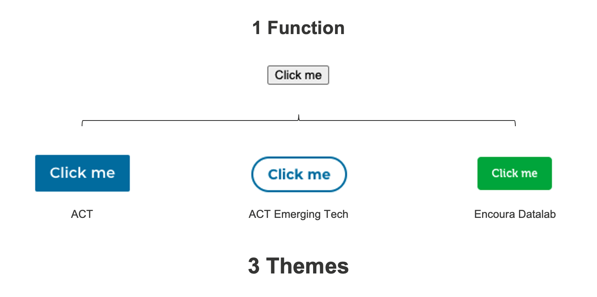

# Building for the DLS

## Introduction

DLS components are maximally flexible and useful when they are decoupled from
business logic, API calls, and stylistic assumptions from a particular
application or use-case.

For that reason, DLS components should be as "dumb" as possible. Ideally, they
merely render based on a set of generic props that are passed in via the
downstream project.

DLS components should work equally well, regardless of the downstream project's
render strategy (e.g. SSR vs. Static), state management solution (e.g. React
Context vs. Redux), framework (e.g. Next.js vs. Create React App), routing
library (e.g. React Router vs. Next Routes, or network layer (e.g. Apollo Client
vs. Fetch).

Simply put, the DLS components should make 0 assumptions about the technologies
being used by the downstream project, aside from one special exception:
[Material UI (v4)](https://v4.mui.com/).

## Material UI

The DLS is based on [Material UI (v4)](https://v4.mui.com/) -- one of the most
popular and robust component libraries that exists today in the React
ecosystem.

[Material UI (v4)](https://v4.mui.com/) is integral to the way the DLS functions
(namely, the theme system), and thus is the only technological requirement that
is forced upon downstream projects.

In order to build effectively for the DLS, you really need to know
[Material UI (v4)](https://v4.mui.com/). So if you're not already, become
familiar with the components (and their APIs) that are offered by the library.

(It is also important to understand how to style components using
[`makeStyles`](https://v4.mui.com/styles/basics/), and how to do so in a
flexible way using [themes](https://v4.mui.com/customization/theming/). But
we'll touch on this later in the guide!)

### Material UI Components > Native DOM Elements

When writing components for the DLS, you should always prefer to use Material UI
components over native DOM elements.

  * If you're building a list (`ul`, `ol`, `li`), use
  [`List`](https://v4.mui.com/api/list/) and
  [`ListItem`](https://v4.mui.com/api/list-item/).

  * If you're writing text (`h1...6`, `p`, `span`), use
  [`Typography`](https://v4.mui.com/api/typography/#typography-api).

  * If you need a button or input field (`button`, `input`, `textarea`), use
  [`Button`](https://v4.mui.com/api/button/#button-api) and
  [`TextField`](https://v4.mui.com/api/text-field/#textfield-api).

Whenever you find yourself writing a native DOM element, stop and ask yourself
if there is a suitable alternative provided by the Material UI library.
(Usually there is!)

Why? Because of themes!

### Themes

The DLS makes full use of Material UI's
[theme system](https://v4.mui.com/customization/theming/). You can think of a
theme as a CSS stylesheet that defines how the components should look and feel.

The DLS currently supports 3 different themes, which each provide their own
unique look and feel on top of the Material UI components:

1. `"ACT"` - for ACT's "traditional" look and feel
2. `"ACT_ET"` - for ACT's "Emerging Technology" look and feel
3. `"ENCOURA_DATALAB"` - for Encoura's "Datalab" look and feel

#### Decoupling Style from Functionality

Themes allow us to separate the way a component functions, from the way the
component looks and feels.



## Decoupling Business Logic from Rendering

### API Calls

DLS component should not contain any API calls:

```jsx
// BAD:
const DlsComponent = () => {
  const { response } = fetch(...);
  const arrayOfItems = response.items;

  return (
    // do something with arrayOfItems
  );
};
```

Instead, API calls should be handled outside of the component and then fed
into the component through generic prop(s).

```jsx
// GOOD:
const NewDlsComponent = ({ items }) => (
  // do something with items
);

const ProjectComponent = () => {
  const { response } = fetch(...);
  const arrayOfItems = response.items;

  return (
    <DlsComponent items={arrayOfItems} />
  );
};
```

### Links & Routes

Links and routes are another form of business logic. They should not be embedded
inside DLS components, otherwise we're forcing

## Decouple Functionality from Style

## Learn Material UI